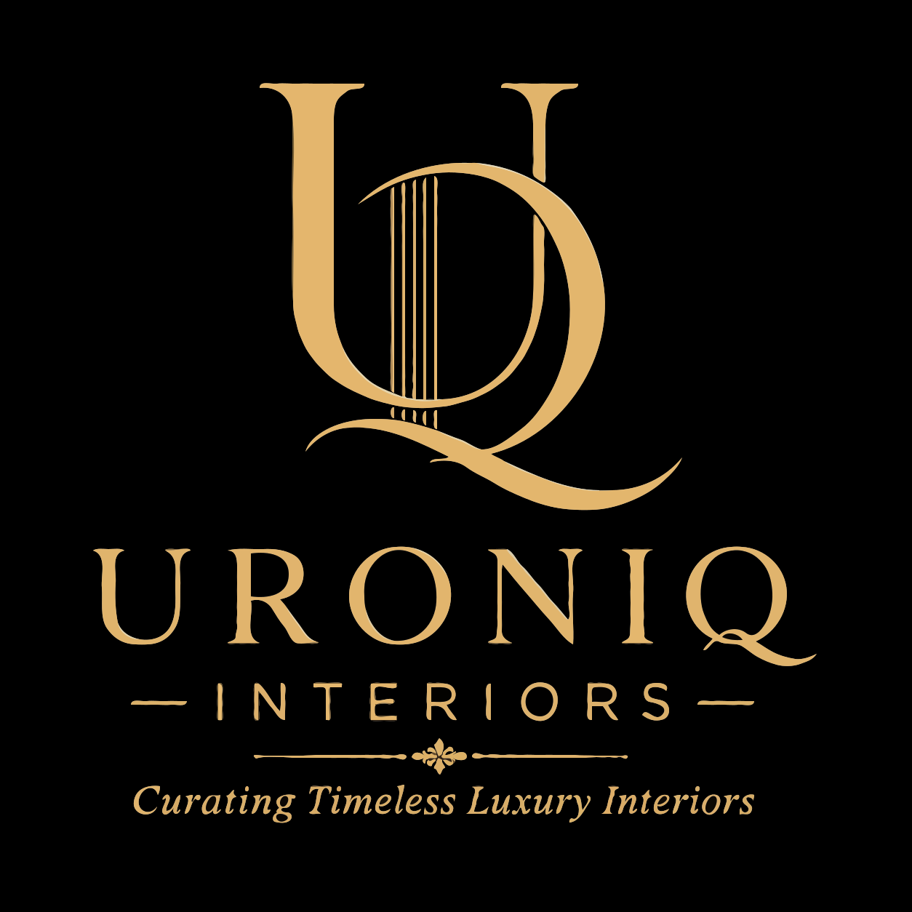

<div align="center">
  
  
  # Uroniq Interiors

  **A modern, luxurious web application for a premium interior design firm.**

  [](https://uroniq-interior.vercel.app/)
  <br>

  <p>
    
    
    
    
    
  </p>
</div>

## ✧ Overview

Uroniq Interiors is a fully responsive, full-stack web application designed to showcase premium interior design portfolios and capture high-quality client leads. It features a dark, luxurious aesthetic with glassmorphism UI elements, smooth scroll animations, and a seamless consultation booking flow.

## ✨ Key Features

- **Luxurious Dark Theme UI**: Built with a custom design system focusing on typography (Playfair Display & Inter) and gold accents.
- **Dynamic Portfolio Showcase**: Beautifully presented galleries for residential and commercial projects.
- **Consultation Booking System**: A comprehensive multi-step modal form for capturing client details and project requirements.
- **Automated Email Notifications**: Powered by Resend API, sending beautifully crafted HTML emails (matching the dark theme) to both the administrative team and the clients.
- **Fully Responsive**: Flawless experience across desktops, tablets, and mobile devices.

## 🛠️ Tech Stack

### Frontend
- **React.js** with Vite for lightning-fast development and optimized builds.
- **Vanilla CSS3** with a custom design system, utilizing CSS variables for consistent theming and glassmorphism effects.
- **Lucide React** for crisp, scalable iconography.

### Backend
- **Node.js & Express.js** providing a robust REST API for handling form submissions.
- **Resend** for reliable transactional email delivery.
- **Cors & dotenv** for secure environment configuration and cross-origin resource sharing.

## 🚀 Getting Started

### Prerequisites
- Node.js (v16+ recommended)
- npm or yarn

### Installation

1. **Clone the repository**
   ```bash
   git clone https://github.com/aritttra/uroniq-interior.git
   cd uroniq-interior
   ```

2. **Setup Frontend**
   ```bash
   cd frontend
   npm install
   npm run dev
   ```

3. **Setup Backend**
   Open a new terminal tab:
   ```bash
   cd backend
   npm install
   # Create a .env file and add your RESEND_API_KEY and RECEIVER_EMAIL
   node server.js
   ```

## 📩 Email Template Design

The application features custom-designed HTML email templates that mirror the website's dark luxury theme, providing a consistent brand experience from the web interface to the user's inbox.

---
<div align="center">
  <p>&copy; 2026 Uroniq Interiors. All Rights Reserved.</p>
</div>
